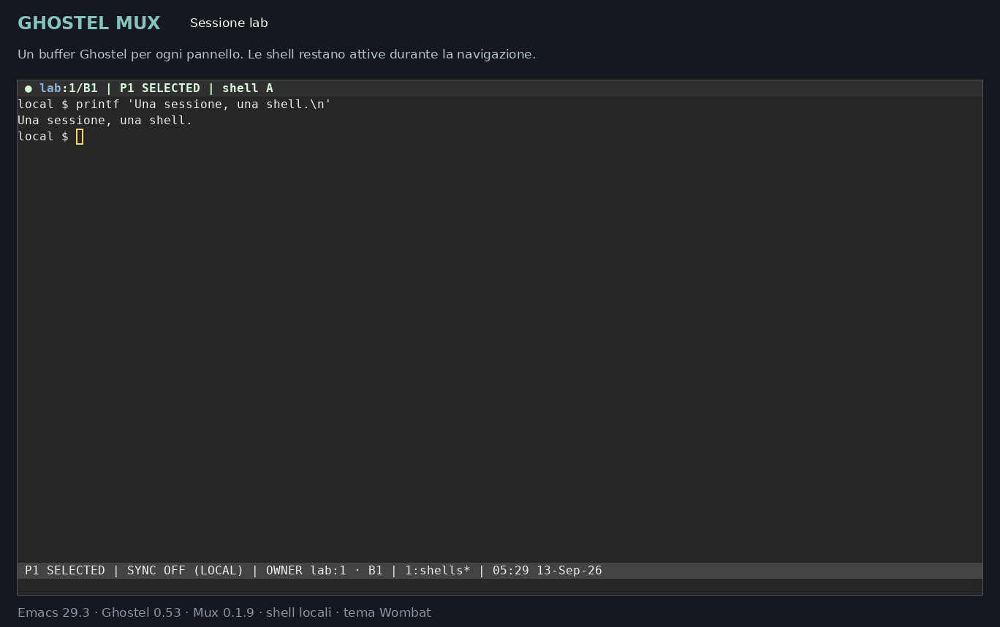
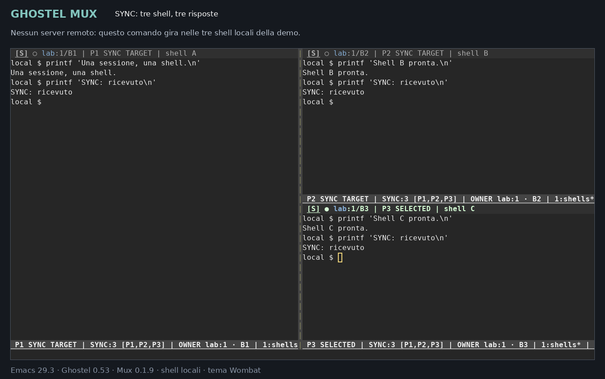
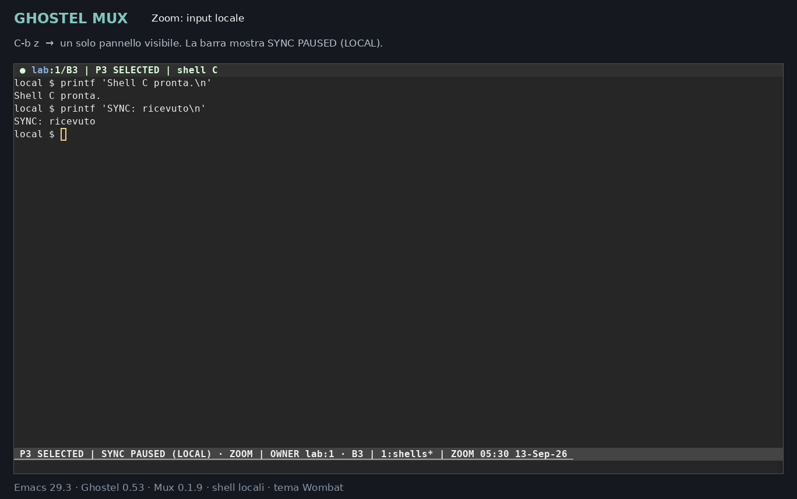
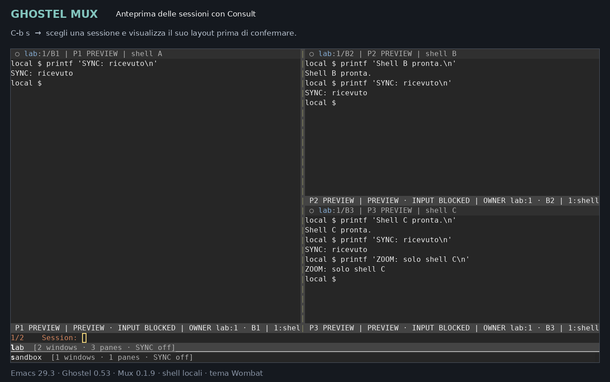

# Ghostel Mux 0.1.9

Un multiplexer per Emacs costruito sopra Ghostel, con sessioni, finestre e
pannelli. Riprende il flusso di lavoro e la configurazione tmux fornita:
prefisso `C-b`, SYNC su `y`, selezione persistente, colori di stato e log
distinti per terminale.

Ogni pannello è un vero buffer Ghostel. Sessioni e finestre conservano i layout
Emacs e i buffer; cambiare sessione o fare zoom non ricrea le shell.

## Demo



[Guarda o scarica il video MP4](docs/media/demo.mp4) ·
[Schermate e dettagli della demo](docs/media/README.md)

Demo reale in Emacs terminale, con shell locali e tema Wombat.
La sequenza mostra split, SYNC sui pannelli visibili, sospensione durante
lo zoom, anteprime di finestre e sessioni e copy mode.

<details>
<summary>Schermate: SYNC, zoom e anteprima delle sessioni</summary>

**SYNC: i marker `[S]` indicano i destinatari.**



**Zoom: l'input resta nel solo pannello visibile.**



**Consult: anteprima del layout prima di cambiare sessione.**



</details>

## Requisiti e installazione

- Emacs **29.1 o successivo** con supporto ai moduli dinamici.
- Ghostel **0.40.0 o successivo**, con il suo modulo nativo compatibile già
  funzionante. Verificato su 0.40.0 e 0.53.0; altre build richiedono una
  verifica dell'adattatore.
- `compat`, installato come dipendenza di Ghostel.
- Per i log completi: backend PTY Emacs. Viene selezionato automaticamente
  per i pannelli registrati; Ghostel continua a usare libghostty per emulazione
  e rendering.

Non occorre modificare o ricompilare Ghostel. Non servono Perspective,
persp-mode, tmux, un nuovo daemon o software da installare sui server remoti.

### Aggiornamento dalla 0.1.0: errore `ghostel-create` mancante

La versione 0.1.1 usa `ghostel-create` quando disponibile e il comando
pubblico `ghostel` con prefisso di creazione forzata sulle versioni precedenti.
La differenza viene gestita all'interno di Mux, senza definire alias in Ghostel.
È gestito anche il precedente nome della variabile del titolo del terminale.

Sostituisci `ghostel-mux.el` con quello nuovo. Se l'avvio precedente si era
fermato al controllo di compatibilità, ricarica il file direttamente:

```text
M-x load-file RET ~/.emacs.d/lisp/ghostel-mux/ghostel-mux.el RET
M-x ghostel-mux RET
```

Questo non richiede di riavviare Emacs o chiudere i tuoi altri terminali.
`M-x ghostel-mux-doctor` mostra anche il percorso della definizione Ghostel
effettivamente caricata, utile se esistono più copie nel `load-path`.

### Aggiornamento dalla 0.1.1–0.1.8

Sostituisci i file del pacchetto ed elimina l'eventuale vecchio
`ghostel-mux.elc`. Puoi mantenere aperte le sessioni e caricare il sorgente:

```text
M-x load-file RET ~/.emacs.d/lisp/ghostel-mux/ghostel-mux.el RET
M-x ghostel-mux-refresh RET
```

La 0.1.2 corregge i prompt aperti tramite `C-b`, compreso `C-b :`:
la mappa del prefisso viene disattivata prima di eseguire il comando scelto.
Per esempio, `C-b :`, `new-session`, Invio, nome della sessione, Invio.
È un selettore dei comandi Mux con completamento Emacs; non interpreta
la sintassi completa di tmux con opzioni come `new-session -s nome`.

Il ricaricamento elimina i vecchi colori predefiniti di Mux e le sue
rimappature dei pannelli, conservando il tema e le personalizzazioni utente.
Applica anche ai pannelli già aperti la chiusura alla fine della shell e
il nuovo ambito SYNC: esclusivamente i destinatari visibili, zoom locale.

La 0.1.3 rende `C-b` un prefisso Emacs nativo e aggiunge `C-b g` per
accedere al prefisso originale `C-c` di Ghostel. Non serve riavviare Emacs.

La 0.1.4 aggiunge l'anteprima delle sessioni con Consult e barre con ruolo
del pannello, stato SYNC e destinatari espliciti. Il caricamento aggiorna
anche le barre dei pannelli già aperti.

La 0.1.5 assegna numeri ai buffer separatamente per sessione, anche a quelli
già aperti: `*mux:produzione:1*`, `*mux:produzione:2*`, `*mux:test:1*`.
La migrazione conserva processi, identità interne e log. Le barre distinguono
appartenenza e gruppo attivo; `C-b a` attiva il gruppo del terminale selezionato.

La 0.1.6 completa gli accenti per sessione, attivi per impostazione predefinita:
colora solo il nome nell'intestazione. Il ricaricamento li applica anche alle
sessioni già aperte. Non occorre aggiungere impostazioni alla configurazione.

La 0.1.7 aggiunge `C-b O` (O maiuscola), inverso di `C-b o`, e l'anteprima
Consult delle finestre con `C-b w`. I nuovi comandi funzionano anche dopo
il ricaricamento con sessioni aperte; Consult resta opzionale.

La 0.1.8 limita `C-b w` alle finestre della **sessione attiva**, mantenendo
l'anteprima Consult. Il prompt ne esplicita il nome: `Window (produzione):`.
Per cambiare sessione usa `C-b s`.

La 0.1.9 aggiunge l'indicatore compatto `[S]` per i destinatari SYNC e
l'anteprima del buffer in `C-b P`. Entrambe le funzioni si applicano anche
a sessioni già aperte. Il progetto è ora versionato con Git; `GIT.md` spiega
come usare il bundle, aggiornare e recuperare una versione precedente.

## Installazione da GitHub

Il repository ufficiale del progetto è
[SweatierKey/ghostel-mux](https://github.com/SweatierKey/ghostel-mux).
Per una nuova installazione:

```sh
mkdir -p ~/.emacs.d/lisp
git clone https://github.com/SweatierKey/ghostel-mux.git ~/.emacs.d/lisp/ghostel-mux
```

Poi aggiungi il blocco `use-package` riportato sotto. Se la cartella esiste
già perché usi lo ZIP, segui la migrazione in [GIT.md](GIT.md), che spiega
anche aggiornamenti e recupero delle versioni precedenti.

## Installazione dallo ZIP

Estrai questa cartella in `~/.emacs.d/lisp/ghostel-mux/`.
Il file deve risultare `~/.emacs.d/lisp/ghostel-mux/ghostel-mux.el`.
Poi usa la stessa configurazione descritta sotto.

## Configurazione Emacs con use-package

Verifica prima che `M-x ghostel` apra un terminale funzionante. Se aggiorni
il modulo nativo di Ghostel, riavvia Emacs dopo l'aggiornamento.

Aggiungi alla tua configurazione Emacs:

```elisp
(use-package ghostel-mux
  :ensure nil
  :load-path "~/.emacs.d/lisp/ghostel-mux/"
  :commands (ghostel-mux)
  :bind ("C-c m" . ghostel-mux)
  :init
  (setq ghostel-mux-directory (expand-file-name "~")
        ghostel-mux-scrollback-bytes (* 50 1024 1024)
        ghostel-mux-log-output t))
```

Valuta il blocco oppure riavvia Emacs. Avvia con `C-c m` o `M-x ghostel-mux`
da un normale buffer Emacs. Le sessioni partono dalla shell locale, nella
home; dentro ogni pannello puoi usare SSH/PSMP.

`:ensure nil` usa la copia locale del pacchetto; `:commands` e `:bind`
ne preparano il caricamento al primo utilizzo. Il blocco imposta il limite
di scrollback a 50 MiB per pannello e abilita i log di output.
Se hai installato Mux in un'altra cartella, adatta `:load-path`.
Questo blocco sostituisce le precedenti forme dedicate a Mux per
`load-path`, `autoload` e `global-set-key`.

`example-init.el` contiene la stessa configurazione e le opzioni principali.
Il pacchetto non installa dipendenze né modifica la tua configurazione da solo.

## Primo utilizzo

1. `M-x ghostel-mux`, nome `produzione-osb`: crea la prima sessione e una shell.
2. `C-b %`: crea un secondo terminale a destra. `C-b "` divide sotto.
3. Esegui il tuo comando SSH o PSMP in ciascun terminale, quindi gli eventuali
   passaggi con sudo. Ogni terminale mantiene la propria connessione.
4. `C-b y`: attiva SYNC nella finestra corrente. La barra indica il numero
   di terminali vivi e visibili destinatari. `C-b y` lo disattiva.
5. `C-b z`: ingrandisce il pannello corrente. Ripetilo per recuperare il layout.
6. `C-b S`, nome `verifica-jms`: crea un'altra sessione. `C-b s` permette di
   scegliere tra quelle aperte. Le shell precedenti rimangono attive.
7. `C-b d`: torna al layout Emacs che c'era prima dell'attach. Le sessioni
   restano selezionabili con `M-x ghostel-mux`.

Puoi creare sessioni anche da Lisp:

```elisp
(ghostel-mux-new-session "produzione-osb")
(ghostel-mux "produzione-osb") ; seleziona, oppure crea se non esiste
```

## Gerarchia

| Oggetto | Contiene | Identità |
|---|---|---|
| Sessione | Una o più finestre del multiplexer | Nome scelto dall'utente |
| Finestra | Un layout Emacs e un gruppo di pannelli | Indice da 1 e titolo |
| Pannello | Buffer Ghostel, PTY, scrollback, file di log | ID stabile interno; indice visibile da 1 |

Una *finestra del multiplexer* è un layout intero; una finestra Emacs mostra
un pannello. I nomi non servono per identificare i destinatari del broadcast:
un titolo cambiato dalla shell non sposta un terminale tra gruppi.

I numeri delle finestre e dei pannelli vengono ricalcolati sulle rispettive
liste dopo una chiusura. I log usano gli ID interni immutabili: un file già
aperto non cambia nome quando rinomini o rinumeri una finestra.

I nomi dei buffer usano un contatore separato per sessione, condiviso dalle
sue finestre: `*mux:produzione:1*`, `*mux:produzione:2*`, ecc. Nell'intestazione
`produzione:2/B3` significa sessione produzione, finestra 2, buffer 3.
Il numero B resta stabile dopo le chiusure; quelli eliminati non vengono
riutilizzati. Il numero P indica invece la posizione nella finestra corrente.
Rinominare la sessione aggiorna anche i nomi dei suoi buffer, conservando
numeri e log. Eventuali buffer estranei con lo stesso nome sono conservati:
Emacs aggiunge un suffisso al nome del terminale.

## Tasti

Premi `C-b`, rilascialo, poi premi il tasto indicato. `C-b` è intercettato
soltanto nei buffer gestiti da Mux e resta disponibile anche nel char mode di
Ghostel. Durante l'attesa, la barra mostra `PREFIX` usando il tema Emacs.
Con `which-key-mode` attivo, aspetta dopo `C-b` per vedere i suggerimenti.
Anche `C-b g` è un prefisso nativo e mostra i propri sottocomandi.

| Tasto dopo `C-b` | Azione |
|---|---|
| `s` | Seleziona una sessione aperta |
| `S` | Crea una sessione, chiedendone il nome |
| `a` | Attiva sessione e finestra del terminale selezionato |
| `$` | Rinomina la sessione |
| `d` | Detach: torna al precedente layout Emacs |
| `c` | Nuova finestra con una nuova shell |
| `w` | Selettore delle finestre della sessione attiva, con anteprima Consult |
| `n` / `p` / `l` | Finestra successiva / precedente / ultima usata |
| `1`…`9` | Finestra per numero; `0` non esiste con indice iniziale 1 |
| `,` | Rinomina la finestra; vuoto ripristina il titolo automatico |
| `&` | Chiude la finestra e i suoi terminali, con conferma |
| `%` / `"` | Nuovo pannello a destra / sotto |
| Frecce | Seleziona il pannello nella direzione indicata |
| `o` / `O` | Pannello successivo / precedente, con ritorno circolare |
| `;` | Ultimo pannello usato |
| `q` | Mostra i numeri; per due secondi puoi premere `1`…`9` |
| `P` | Selettore completo dei pannelli, anche oltre il nono |
| `z` | Zoom/unzoom con ripristino del layout |
| `x` | Chiude il pannello e la sua shell, con conferma |
| Spazio | Alterna layout tiled, orizzontale e verticale |
| `M-5` | Ridispone tutti i pannelli nel layout tiled, anche partendo dallo zoom |
| `C-freccia` / `M-freccia` | Ridimensiona di 1 / 5 unità |
| `T` | Etichetta manuale del pannello; vuoto ripristina il titolo OSC |
| `y` | Attiva/disattiva SYNC nella finestra corrente |
| `g` | Prefisso originale di Ghostel: attendi per i suggerimenti which-key |
| `C-b` | Invia un `C-b` letterale al terminale, o al gruppo in SYNC |
| `[` | Entra nella modalità copia |
| `]` | Incolla dal kill ring, con bracketed paste per ogni terminale |
| `=` | Copia l'intero scrollback conservato del pannello corrente |
| `e` | Esporta lo scrollback conservato come testo UTF-8 |
| `L` | Apre il file di log grezzo del pannello |
| `t` | Mostra ora e data nell'echo area |
| `r` | Aggiorna la presentazione dopo una modifica alle impostazioni |
| `:` | Selettore dei comandi Mux, incluso `kill-session` e `doctor` |
| `?` | Aiuto |

Le liste usano `completing-read`: funzionano con il completamento standard di
Emacs e con Vertico/Ivy se già configurati.

In modalità terminale `C-c`, `C-z` e `C-d` vengono inviati direttamente come
interrupt, suspend ed EOF. Questo riprende l'uso di tmux: nei pannelli Mux il
prefisso `C-c` di Ghostel è accessibile tramite **`C-b g`**, oltre a `M-x`.
La mappa è quella originale, comprese le personalizzazioni che le aggiungi.
In semi-char mode `C-x` e `M-x` rimangono comandi Emacs;
in char mode valgono le regole di Ghostel, con `M-RET` per uscirne.

| Sequenza completa | Comando Ghostel |
|---|---|
| `C-b g C-e` | Emacs mode |
| `C-b g C-j` | Semi-char mode, per tornare all'input terminale |
| `C-b g M-d` | Char mode |
| `C-b g C-t` | Copy mode |
| `C-b g C-l` | Line mode |
| `C-b g M-w` | Copia tutto lo scrollback conservato |

`which-key` resta opzionale e usa il ritardo impostato nella tua configurazione.
I prefissi funzionano anche senza il pacchetto. Emacs riconosce le sequenze
complete: per esempio `M-x describe-key`, poi `C-b g C-e`, mostra il comando
Ghostel corrispondente. I comandi numerici e di resize hanno nomi propri
per comparire in modo comprensibile nei suggerimenti e nell'aiuto.

Per finestre oltre la nona usa `C-b w` o `M-x ghostel-mux-window-by-number`.
`C-b :` è un selettore di comandi Emacs, non un interprete della sintassi tmux.
`r` aggiorna la presentazione: non legge `~/.tmux.conf`.

## Anteprima delle sessioni e delle finestre

Con Consult installato, `C-b s` mostra il layout della sessione evidenziata
nella lista. Funziona anche dal selettore iniziale di `M-x ghostel-mux`
quando esistono sessioni aperte. Con Vertico puoi scorrere con `C-n`/`C-p`:
`Invio` conferma, `C-g` annulla e ripristina la vista iniziale.

L'anteprima usa `consult-preview-key`, come gli altri comandi Consult.
Mostra la finestra ricordata dalla sessione, compreso l'eventuale zoom, senza
creare terminali o cambiare la sessione effettivamente collegata. Durante
la scelta compare `PREVIEW · INPUT BLOCKED`: l'input interattivo ai terminali
è bloccato; l'output dei processi continua normalmente.

La lista annota il numero di finestre, i pannelli della finestra ricordata,
zoom e opzione SYNC. Le sessioni collegate a un altro frame sono elencate,
ma senza anteprima, per non alterare la vista in uso su quel frame. Il
trasferimento al frame corrente avviene solo confermando la selezione.

Consult è opzionale: senza il pacchetto resta il selettore Emacs normale.
Puoi disattivare l'anteprima con `(setq ghostel-mux-session-preview nil)`.

`C-b w` elenca solo le finestre della sessione attiva e mostra l'anteprima della
**finestra esatta** evidenziata, con i suoi buffer e l'eventuale zoom. A
esempio, scegliere `produzione:2` mostra la finestra 2 anche se produzione
ricordava come attiva la finestra 1. Invio attiva la finestra scelta; C-g
ripristina quella iniziale. Le anteprime non cambiano il gruppo collegato
né la finestra ricordata dalle altre sessioni. Se la finestra scelta termina
durante la selezione, Mux segnala che non è più disponibile.

L'ambito è la sessione collegata al frame, anche se nel pannello selezionato
hai mostrato un terminale di un'altra sessione con `switch-to-buffer`.
`C-b s` cambia sessione; `C-b a` attiva quella del terminale selezionato.
Senza una sessione attiva, `C-b w` segnala che occorre collegarne una.

La stessa protezione dell'input e dei frame vale per entrambi i selettori.
Per disattivare solo l'anteprima di `C-b w`:

```elisp
(setq ghostel-mux-window-preview nil)
```

`C-b o` e `C-b O` percorrono in direzioni opposte i pannelli registrati della
finestra Mux del terminale selezionato. Passato un estremo ripartono dall'altro;
funzionano anche nello zoom. `C-b ;` conserva invece il significato di
"ultimo pannello usato".

`C-b P` elenca i pannelli della finestra Mux attiva e mostra il buffer del
candidato nel riquadro da cui hai aperto il selettore. Gli altri riquadri
restano visibili. Puoi vedere anche un terminale nascosto o un altro pannello
mentre sei in zoom, senza attivarlo fino a Invio. C-g ripristina la vista,
il pannello selezionato e l'ambito SYNC originali. Come negli altri selettori,
la digitazione verso i terminali è bloccata durante l'anteprima, mentre
l'output dei processi continua. Se il pannello termina, Mux ne segnala
l'indisponibilità. Per disattivare solo questa anteprima:

```elisp
(setq ghostel-mux-pane-preview nil)
```

## Mouse e copia

La selezione col mouse usa il comportamento Ghostel e passa in copy mode.
In copy mode:

- Trascinamento: la selezione rimane dopo il rilascio.
- Doppio clic: seleziona la parola.
- Triplo clic: seleziona la riga, includendo il suo newline.
- Clic singolo: sposta il punto e cancella la selezione, senza uscire.
- `M-w`: copia, cancella la selezione e resta in copy mode.
- `C-w`: copia ed esce. **Non elimina testo dal terminale.**
- `C-g`: cancella la selezione, senza uscire.
- `q`: esce dalla modalità copia.

Puoi usare `C-s`, `C-r`, `occur`, `M-<`, `M->` e i normali movimenti Emacs.
La copia della selezione usa il filtro di Ghostel per eliminare i newline
introdotti dal solo wrapping visivo. `C-b =` copia direttamente dallo stato
del terminale, anche se il buffer visualizzato era congelato.

Mouse e clipboard seguono il supporto di Emacs. In un Emacs TTY va abilitato
`xterm-mouse-mode` per usare gli eventi mouse; in un Emacs grafico non serve.
Il trasferimento dal kill ring alla clipboard Windows dipende dalla tua
configurazione WSL/Emacs già esistente.

## SYNC: ambito e comportamento

SYNC appartiene alla **finestra del multiplexer**. Non coinvolge altre
finestre, altre sessioni o terminali Ghostel aperti normalmente.

**SYNC invia solo ai pannelli vivi, appartenenti alla finestra Mux corrente,
visibili nel frame Emacs in cui stai scrivendo.** Un buffer aperto ma nascosto
non riceve input. La regola vale anche se nascondi un pannello con comandi
Emacs normali o mostri al suo posto un altro buffer. Altri frame non sono
destinatari. Due viste dello stesso buffer ricevono una sola consegna.

Puoi mostrare buffer appartenenti a sessioni diverse nello stesso layout.
`switch-to-buffer` cambia ciò che vedi, senza cambiare il gruppo Mux attivo.
Se il gruppo attivo è `Y:1` e selezioni un terminale di `X:2`, la barra mostra
`SELECTED · LOCAL`, `OWNER X:2` e `ACTIVE Y:1`. La digitazione in X resta
locale; `C-b y` continua a commutare SYNC in Y e il messaggio lo esplicita.
`C-b a` attiva X e la sua finestra 2, ripristinandone il layout e selezionando
quel terminale. Come ogni cambio finestra, recupera anche il suo stato SYNC.

Con cinque terminali del gruppo attivo e uno sostituito da scratch, SYNC
raggiunge soltanto i quattro terminali visibili. `C-b M-5` ripristina e dispone
tutti i terminali registrati nella finestra Mux attiva, incluso quello nascosto.
Scratch e gli eventuali terminali estranei restano vivi ma non sono visualizzati.
Se SYNC era abilitato, i terminali ripristinati tornano a ricevere input.

**Durante lo zoom l'input è locale al pannello ingrandito.** L'opzione SYNC
resta memorizzata, ma la barra mostra `SYNC PAUSED (LOCAL)` quando rimane
un solo destinatario visibile. Con lo zoom out torna `SYNC:n` e il broadcast
riprende sui pannelli nuovamente visibili. `C-b y` spegne completamente
l'opzione, così resta spenta anche dopo lo zoom out.

I destinatari sono calcolati al momento dell'input, con un nuovo controllo
di visibilità prima di ogni consegna. Questa regola copre tasti, interrupt,
prefisso letterale, stringhe e incolla, anche multilinea.

Il broadcast ripete le operazioni di input, usando l'encoder di ciascun
terminale per i tasti e per il bracketed paste. Gestisce digitazione,
frecce, modificatori, interrupt, incolla e gli invii del line mode di Ghostel.
Il line mode mantiene locale la modifica della riga e invia la riga al gruppo
quando premi Invio.

Restano locali: navigazione Emacs, comandi Mux, selezioni e mouse destinato a
programmi interattivi, risposte ai protocolli terminale e invii automatici da
callback, incluso il gestore password di Ghostel. Le password digitate
manualmente con SYNC attivo sono input da tastiera e vengono replicate.
Gli invii programmatici di altri pacchetti restano locali per impostazione
predefinita; il pacchetto non promette di riconoscere ogni comando personalizzato.

Se un invio fallisce su un terminale, SYNC viene disattivato e viene segnalata
la consegna parziale. L'input già consegnato non viene ripetuto automaticamente.
SYNC replica input; non attende che i comandi finiscano contemporaneamente.

## Scrollback e log completi

Il valore iniziale è **50 MiB per terminale**, configurabile con
`ghostel-mux-scrollback-bytes`. È una dimensione in byte e non equivale
esattamente a `history-limit 50000`: il numero di righe dipende dalla larghezza
e dal contenuto. Libghostty ed Emacs mantengono rappresentazioni proprie dello
storico, quindi questo valore non è un limite alla RAM totale del pannello.

I log, attivi per impostazione predefinita, registrano l'output grezzo ricevuto
dalla PTY in un file distinto per pannello, anche quando è nascosto, in copy
mode o quando lo storico in memoria viene troncato. Contengono sequenze ANSI,
carriage return e tutto ciò che il programma stampa; non sono una trascrizione
testuale già ripulita. Gli input non vengono intercettati dal logger, ma il
testo che la shell riecheggia fa naturalmente parte dell'output.

- Percorso iniziale: `~/.emacs.d/ghostel-mux-logs/`, relativo a
  `user-emacs-directory`.
- Directory creata con permessi `0700`; nuovi file con `0600`.
- Nomi con sessione sanificata, ID di finestra/pannello, timestamp e suffisso
  univoco. Nessuna interpolazione in un comando shell.
- Flush ogni secondo e a 64 KiB; flush anche alla chiusura del buffer e di
  Emacs. Un arresto improvviso può perdere l'ultima porzione non scritta.
- I log non vengono cancellati quando chiudi sessioni o pannelli. Non c'è
  rotazione automatica nella versione 0.1.0.
- Un errore di scrittura produce `LOG ERROR` e un avviso, lasciando attivo il
  terminale.

Con i log attivi il pacchetto usa la PTY di Emacs perché il percorso nativo
Ghostel elabora i byte fuori da Emacs Lisp e non espone un tap pubblico
equivalente. Questo comporta un costo maggiore per output molto intenso;
il parser e il rendering restano quelli di Ghostel/libghostty.

Per usare il backend nativo nei **nuovi** pannelli:

```elisp
(setq ghostel-mux-log-output nil)
```

La modifica non converte i terminali già aperti. Il logger richiede una
directory locale: non esegue scritture TRAMP nell'output filter.

## Aspetto e integrazione Emacs

Ogni pannello mostra un ruolo esplicito:

| Indicazione | Significato |
|---|---|
| `[S]` | Destinatario dell’input sincronizzato dal terminale selezionato |
| `P2 SELECTED` | Pannello selezionato per l'input |
| `P1 SYNC TARGET` | Altro pannello visibile incluso nel broadcast |
| `P1 SELECTED · LOCAL` | Terminale selezionato appartenente a un altro gruppo; input locale |
| `P1 OTHER GROUP` | Terminale di un altro gruppo; escluso da SYNC del gruppo attivo |
| `P1 INACTIVE` | Non selezionato e non destinatario di SYNC; il processo continua |
| `SYNC OFF (LOCAL)` | SYNC disattivato, input locale |
| `SYNC:3 [P1,P2,P3]` | Numero e identità dei destinatari visibili |
| `SYNC PAUSED (LOCAL) · ZOOM` | Zoom attivo, input locale; SYNC riprende con lo zoom out |

L'indicatore `[S]` compare all'inizio dell'intestazione, prima del nome,
su tutti i destinatari del broadcast, incluso il terminale selezionato.
Tiene conto dei pannelli vivi e visibili e della sessione attiva: sparisce
in zoom, durante le anteprime e quando selezioni un buffer estraneo al
gruppo o un buffer di testo. L'opzione SYNC può restare memorizzata anche
quando non ci sono indicatori. In copy mode i normali comandi di copia
restano locali, ma un incolla esplicito nel terminale può ancora essere
sincronizzato: `[S]` continua quindi a indicarne i destinatari. Il colore
del nome identifica soltanto la sessione e non cambia con SYNC.

La barra inferiore mette ruolo e SYNC prima dei titoli lunghi. L'intestazione
mostra prima sessione, numero della finestra e numero stabile del buffer,
poi ruolo e titolo del terminale. Nelle viste miste indica anche il gruppo
attivo. Passando il mouse sulle barre trovi la spiegazione dei comandi e
dell’ambito SYNC. Lo stato
SYNC resta leggibile quando compare PREFIX. Nei pannelli stretti Emacs può
troncare il testo: lo zoom permette di leggerlo per intero.

Mux conserva gli sfondi del tema Emacs. Solo il **nome della sessione
nell'intestazione** riceve un accento colorato: tutti i suoi pannelli usano
lo stesso colore, anche nelle anteprime e nelle viste miste. Numeri, titoli,
COPY, SYNC e barra inferiore conservano i rispettivi stili. Il colore indica
l'appartenenza: non significa che il terminale riceverà input sincronizzato.

La palette comprende otto tonalità, con varianti per temi chiari e scuri.
L'assegnazione sceglie un colore libero o, se tutti sono già usati, quello
meno usato tra le sessioni aperte. Non cambia quando rinomini la sessione,
passi a un'altra finestra o ricarichi il sorgente. La tinta si adatta al tema;
l'associazione con la sessione resta la stessa. Dopo otto sessioni i colori
possono ripetersi: il nome testuale resta il riferimento preciso.

Per disattivare gli accenti:

```elisp
(setq ghostel-mux-session-colors nil)
```

Puoi riattivarli con `t`; le assegnazioni precedenti vengono conservate.
`M-x customize-group RET ghostel-mux RET` espone l'opzione e le otto facce
`ghostel-mux-session-*`, personalizzabili anche con `customize-face`.
`ghostel-mux-session-color-faces` permette di sostituire o ampliare la palette:
usa facce che impostano solo il primo piano. Rimuovere una faccia dalla lista
riassegna le sessioni che la usavano. Una lista vuota disattiva gli accenti.
Dopo modifiche da Lisp puoi richiamare `M-x ghostel-mux-refresh`.

I colori predefiniti sono distinguibili anche in un terminale a 256 colori.
Su terminali con meno di 89 colori si usa il testo del tema, mantenendo i nomi.
Le associazioni durano quanto le sessioni nel processo Emacs; non vengono
salvate tra riavvii. PREFIX e SYNC rimangono riconoscibili tramite i loro
indicatori testuali e stili; i colori ANSI espliciti dei programmi restano tali.

In copy mode, `[COPY MODE]` compare all'inizio dell'intestazione e della
barra inferiore, prima dei titoli. L'intestazione ricorda `q` per uscire,
`M-w` per copiare restando nella modalità e `C-w` per copiare e uscire.
`C-b [` mostra anche un messaggio all'ingresso. L'indicatore segue la modalità
effettiva di Ghostel, anche entrando tramite i suoi comandi o il mouse.

L'intestazione mostra numero, titolo e selezione del pannello. Il titolo
automatico segue l'OSC title della shell quando disponibile. Un'etichetta
manuale prevale finché non viene cancellata. Non viene eseguito polling remoto
per indovinare il processo in primo piano.

La presentazione usa header line e mode line Emacs per pannello. Non riproduce
pixel per pixel i bordi e l'unica status bar inferiore di tmux; non cambia il
tema globale né i buffer Ghostel non gestiti.

Personalizza le facce `ghostel-mux-normal`, `ghostel-mux-sync`,
`ghostel-mux-prefix`, `ghostel-mux-active` e `ghostel-mux-copy`
con `M-x customize-group RET ghostel-mux`.

Il layout conserva anche eventuali buffer Emacs aggiunti durante il lavoro.
I comandi di layout espliciti (Spazio o `C-b M-5`) ricostruiscono invece la griglia dei
terminali. Non usare simultaneamente un altro gestore di workspace per
riorganizzare lo stesso frame mentre Mux è attached; fai detach prima.

Per bilanciare le dimensioni mantenendo la disposizione corrente, Emacs
offre `C-x +` (`balance-windows`, disponibile in semi-char o copy mode).
Da Mux puoi anche usare `C-b : balance`: esce dall'eventuale zoom e bilancia
la disposizione completa. `C-b M-5` ricrea invece il layout tiled.

L'apertura di file remoti resta affidata all'integrazione Ghostel/TRAMP
esistente. Mux mantiene i terminali separati, ma non deduce automaticamente
una catena PSMP/SSH/sudo dalla schermata del terminale. Le nuove divisioni
usano la directory iniziale della finestra, evitando che un cambio di directory
rilevato sul remoto faccia partire involontariamente una nuova shell TRAMP.

## Durata delle sessioni

Una sessione può essere attached a un frame per volta. Se la selezioni in un
altro frame, Mux la stacca dal precedente, ripristinandone il layout Emacs.
La chiusura di un frame lascia la sessione disponibile negli altri frame
finché il processo Emacs vive.

`C-b d` non chiude le shell. La chiusura del processo Emacs non è un detach
persistente: il pacchetto non fornisce un server esterno come tmux. Un
eventuale Emacs daemon deve restare vivo per mantenere i suoi terminali.

Quando termina il processo del terminale, Mux chiude automaticamente il suo
buffer e il pannello. L'ultimo pannello chiuso rimuove la finestra; l'ultima
finestra rimossa elimina la sessione e ripristina l'ambiente Emacs precedente.
Il log di output, se attivo, viene salvato prima della chiusura e resta su
disco. Lo scrollback del buffer chiuso non resta in memoria.

Se esegui `ssh host` dentro Bash, la fine di SSH può riportarti al prompt
locale: Bash è ancora vivo, quindi il pannello rimane. Se vuoi che la fine
della connessione chiuda il pannello, `exec ssh host` sostituisce la shell
locale con SSH; non tornerai al prompt locale al termine della connessione.

## Verifiche e diagnosi

La versione consegnata è stata compilata e provata con **Emacs 29.3**,
**Ghostel 0.40.0 e 0.53.0** e i rispettivi moduli Linux x86_64, con shell Bash e PTY reali.
I test includono input da tastiera mediante keyboard macro, mouse sintetico,
layout, sessioni, zoom, log, backend nativo e due terminali con modalità di
codifica delle frecce differenti. I dettagli sono in `VALIDATION.md`.

Non è stata eseguita una prova con il tuo Emacs grafico Windows/WSL,
le tue connessioni CyberArk o i tuoi server aziendali.

`M-x ghostel-mux-doctor` mostra l'Emacs in uso, il percorso di Ghostel e le
funzioni attese dall'adattatore. Il controllo blocca l'avvio se manca un punto
di integrazione richiesto; la sola presenza delle funzioni non certifica
la compatibilità semantica di una futura versione Ghostel.

Per ripetere i test con Ghostel installato normalmente:

```sh
cd ~/.emacs.d/lisp/ghostel-mux
make test
```

Oppure con checkout locali, indicando i percorsi effettivi:

```sh
GHOSTEL_LISP=/percorso/ghostel/lisp \
COMPAT_LISP=/percorso/compat \
GHOSTEL_MODULE_DIR=/percorso/ghostel \
make test
```

I test aprono soltanto shell locali di prova, usano directory temporanee e le
rimuovono al termine. Non usano i tuoi host e non richiedono accesso alla rete.
Il modulo deve essere già disponibile: durante i test non viene scaricato.

Per rimuovere il pacchetto chiudi le sue sessioni, rimuovi le forme dalla
configurazione e riavvia Emacs. È disponibile anche
`M-x unload-feature RET ghostel-mux` dopo avere chiuso tutte le sessioni.
I file di log rimangono sul disco.

## Riferimenti

- [Ghostel e documentazione delle API](https://dakra.github.io/ghostel/)
- [Sorgente Ghostel](https://github.com/dakra/ghostel)

L'adattatore è stato verificato sul blob `ghostel.el`
`1c496a1fde8285dce98ba2ec4dd52b77bd066166`, che dichiara versione 0.53.0.
Ghostel e il relativo modulo non sono inclusi nell'archivio.

Licenza di Ghostel Mux: GPL-3.0-or-later; vedi `COPYING`.
