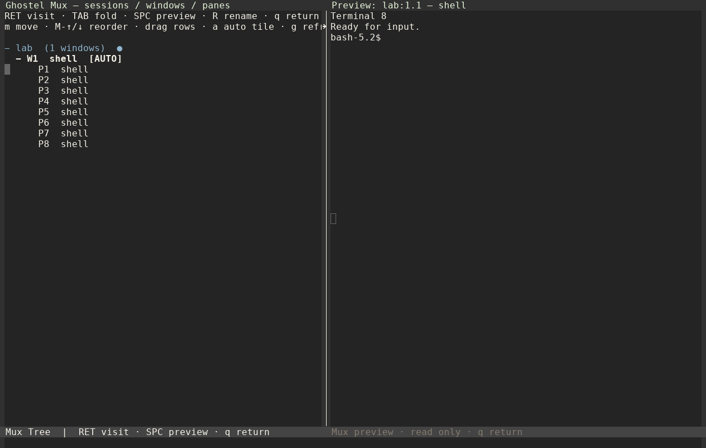
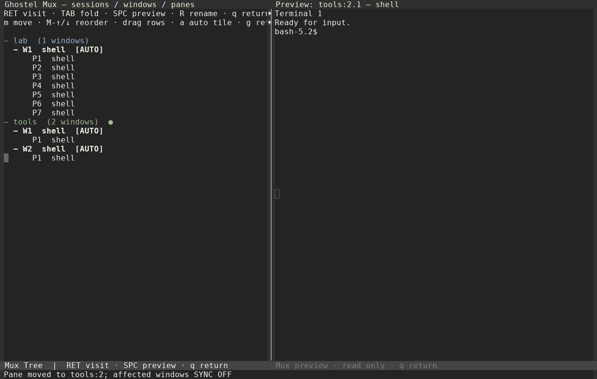

# Ghostel Mux 0.3.0

Un multiplexer per Emacs costruito sopra Ghostel: **sessioni → finestre →
pannelli**, con tasti ispirati a tmux. Ogni pannello è un vero terminale
Ghostel con la propria shell, PTY, connessione SSH, scrollback e log.

Cambiare sessione, fare zoom o trasferire un pannello conserva i processi.
SYNC invia soltanto ai terminali **vivi e visibili della finestra Mux attiva**.
Durante lo zoom l'input resta nel solo pannello visibile.

## Schermate

**Otto pannelli, una sola barra compatta per terminale.**



**Albero con anteprima laterale di sola lettura.**



Schermate reali della 0.3.0, Emacs grafico su Linux e tema Wombat.
Sono disponibili anche la [GIF](docs/media/demo.gif) e il
[video MP4](docs/media/demo.mp4) della **0.1.9**: mostrano il flusso SYNC,
zoom e Consult, ma la loro grafica precede le nuove barre e l'albero.

## Installazione con use-package

Servono **Emacs 29.1+**, Git e **Ghostel 0.40.0+** con il modulo nativo
funzionante. Prova prima `M-x ghostel`; `compat` è una sua dipendenza.
Questa versione è verificata su Ghostel 0.40.0 e 0.53.0.

Aggiungi il seguente blocco all'init. **Installa automaticamente** il clone in
`~/.emacs.d/lisp/ghostel-mux/` al primo avvio, poi prepara `C-c m`.
Non serve un clone manuale preliminare.

```elisp
(use-package ghostel-mux
  :ensure nil
  :load-path "~/.emacs.d/lisp/ghostel-mux/"
  :commands (ghostel-mux)
  :bind ("C-c m" . ghostel-mux)
  :init
  ;; Clone once, directly into the requested directory.
  ;; An existing installation is kept; updates are explicit git pull operations.
  (let* ((dir (expand-file-name "~/.emacs.d/lisp/ghostel-mux/"))
         (source (expand-file-name "ghostel-mux.el" dir)))
    (unless (file-exists-p source)
      (when (file-exists-p (directory-file-name dir))
        (error "Ghostel Mux: %s exists but ghostel-mux.el is missing" dir))
      (unless (executable-find "git")
        (error "Ghostel Mux: install Git and restart Emacs"))
      (make-directory (file-name-directory (directory-file-name dir)) t)
      (let ((stage (make-temp-file
                    (expand-file-name ".ghostel-mux-install-"
                                      (file-name-directory (directory-file-name dir))) t)))
        (unwind-protect
            (progn
              (unless (zerop (process-file
                             "git" nil "*Ghostel Mux install*" nil "clone" "--"
                             "https://github.com/SweatierKey/ghostel-mux.git" stage))
                (error "Ghostel Mux: clone failed; see *Ghostel Mux install*"))
              (unless (file-exists-p (expand-file-name "ghostel-mux.el" stage))
                (error "Ghostel Mux: incomplete checkout"))
              (rename-file stage (directory-file-name dir)))
          (when (file-directory-p stage) (delete-directory stage t))))))
  (setq ghostel-mux-directory (expand-file-name "~")
        ghostel-mux-scrollback-bytes (* 50 1024 1024)
        ghostel-mux-log-output t))
```

È lo stesso blocco di [example-init.el](example-init.el).
`:ensure nil` evita di cercare Mux negli archivi ELPA: il clone viene
installato dalla sezione `:init`, mentre `:load-path`, `:commands` e
`:bind` preparano il caricamento al primo utilizzo.
L'installazione usa una cartella temporanea e la rinomina soltanto quando
il clone è completo; in caso di errore puoi riprovare senza un checkout
parziale nella destinazione. Non sovrascrive una directory già esistente.

Se hai già installato Mux, il blocco **non riclona e non aggiorna** il pacchetto.
Per una cartella diversa, modifica sia `:load-path` sia `dir`.
Ghostel e il modulo nativo restano gestiti dalla tua installazione Ghostel.

### Aggiornamento

```sh
git -C ~/.emacs.d/lisp/ghostel-mux pull --ff-only
```

Poi riavvia Emacs oppure carica il sorgente, conservando le shell aperte:

```text
M-x load-file RET ~/.emacs.d/lisp/ghostel-mux/ghostel-mux.el RET
```

Se l'albero era aperto durante l'aggiornamento, chiudilo con `q` e riaprilo
con `C-b b`. La 0.3.0 aggiorna nomi e barre anche nei pannelli già esistenti;
gli ID interni e i log restano invariati.
Se aggiorni **il modulo nativo di Ghostel**, riavvia invece Emacs.

Per il clone manuale o lo ZIP: la directory deve contenere direttamente
`ghostel-mux.el`; puoi usare lo stesso blocco, che rileva la copia presente.
Le istruzioni Git sono anche in [GIT.md](GIT.md).

## Primo utilizzo

1. `C-c m` crea subito la prima sessione, `session-1`, senza chiedere un nome.
2. `C-b %` o `C-b "` aggiunge un terminale e ridistribuisce il layout.
3. Esegui SSH/PSMP separatamente in ciascun pannello.
4. `C-b y` attiva SYNC sui destinatari visibili. La barra mostra `[S:N]`.
5. `C-b z` ingrandisce il pannello; ripetilo per recuperare il layout.
6. `C-b S` crea immediatamente un'altra sessione: `session-2`, `session-3`…
   I nomi occupati vengono saltati. `C-b $` rinomina la sessione in seguito.
7. `C-b s` seleziona una sessione con anteprima Consult; `C-b b` apre l'albero.
8. `C-b d` torna al layout Emacs precedente, lasciando vive le shell.

Con un argomento prefisso, `C-u C-b S` chiede subito un nome
(in una modalità che lascia `C-u` a Emacs). Da Lisp:

```elisp
(ghostel-mux-new-session)                ; nome progressivo
(ghostel-mux-new-session "produzione")   ; nome esplicito
(ghostel-mux "produzione")              ; seleziona o crea
```

Con sessioni già presenti, `C-c m` apre il selettore e permette anche di
crearne una scrivendo un nome nuovo. `C-b : new-session` crea senza prompt
aggiuntivo; per rinominare usa `C-b $` o `rename-session`.

## Gerarchia e numerazione

| Oggetto | Contenuto | Nome visibile |
|---|---|---|
| Sessione | Finestre Mux | Nome progressivo o scelto |
| Finestra Mux | Un layout e i suoi pannelli | W1, W2… nella sessione |
| Pannello | Buffer Ghostel e processo | P1, P2… nella finestra |

Una finestra Mux è un layout intero; una finestra **Emacs** ne visualizza
un pannello. Ogni terminale ha un solo proprietario: mostrare il suo buffer
altrove con `switch-to-buffer` non ne cambia l'appartenenza. I comandi di
spostamento, invece, la cambiano davvero.

La barra usa `produzione:2.3`: sessione **produzione**, finestra **2**,
pannello **3**. Il buffer si chiama `*mux:produzione:2.3*`.
Chiudendo, spostando o riordinando, i numeri tornano contigui da 1 nei
rispettivi genitori e i nomi dei buffer si aggiornano.

Il vecchio **B** era un contatore dei buffer condiviso dalle finestre di una
sessione. È stato rimosso dall'interfaccia: W e P bastano per indicare la
posizione. L'identità reale resta un ID interno stabile, indipendente dal
nome: rinumerare non riavvia processi e non rinomina log già aperti.
Eventuali buffer estranei con un nome coincidente sono conservati; Emacs
aggiunge un suffisso al nome del terminale.

## Albero, anteprima e spostamenti

`C-b b` apre un buffer in stile Dired, con titolo, promemoria dei tasti,
righe selezionabili e rami comprimibili. È un gestore di terminali:
non esegue operazioni sui file del filesystem.

| Nell'albero | Azione |
|---|---|
| `n` / `p`, frecce | Cambia riga e aggiorna l'anteprima |
| `TAB` | Espande/comprime sessione o finestra |
| `RET`, doppio clic | Visita la voce nel suo layout |
| `SPC` | Mostra/nasconde l'anteprima laterale |
| `R` | Rinomina sessione, finestra o pannello |
| `m` | Sceglie una destinazione e trasferisce la voce |
| `M-↑` / `M-↓` | Riordina prima/dopo il fratello precedente/successivo |
| Trascinamento | Riordina o cambia proprietario |
| `a` | Attiva/disattiva il tiling della finestra |
| `g` | Aggiorna |
| `q` | Chiude l'albero e ripristina i terminali |

L'anteprima è una **copia di sola lettura del testo renderizzato** del
pannello selezionato, aggiornata navigando e durante i refresh.
Se selezioni una sessione/finestra, mostra il suo pannello attivo.
Non collega la shell a quella vista e non può inviare input, anche con SYNC
abilitata. Mostra la coda renderizzata, fino a 100.000 caratteri: per cercare
o copiare lo scrollback completo, visita il terminale e usa la copy mode.
Non è una riproduzione delle immagini o di ogni dettaglio grafico del terminale.
In un frame troppo stretto l'anteprima laterale non viene aperta.

```elisp
(setq ghostel-mux-tree-preview nil) ; avvia l'albero senza anteprima
```

### Trascinamento

- **Pannello → pannello**: inserisce sopra/sotto quella voce, anche fra
  finestre e sessioni diverse.
- **Pannello → finestra**: lo aggiunge a quella finestra.
- **Pannello → sessione**: crea nella destinazione una nuova finestra
  contenente il pannello trasferito.
- **Finestra → finestra**: inserisce sopra/sotto la finestra indicata,
  cambiando sessione quando necessario.
- **Finestra → sessione**: trasferisce la finestra alla fine della sessione.

In Emacs grafico, la metà superiore/inferiore della riga sceglie
prima/dopo. Nel terminale, dove manca la frazione di pixel, un trascinamento
verso il basso inserisce dopo e verso l'alto prima.
Le sessioni sono contenitori; non vengono trascinate dentro altre sessioni.
Un rilascio fuori dalle righe non modifica l'albero.
`M-↑/↓` e `m` offrono le stesse operazioni senza mouse.

### Spostamento da terminale

`C-b m` sposta il pannello; `C-b M` sposta tutta la finestra.
Nel selettore dei pannelli, `sessione / [new window]` crea la nuova finestra
senza avviare un'altra shell. `C-g` annulla. Dal terminale si segue l'oggetto
trasferito; dall'albero si resta nell'albero.

Spostare conserva processo, connessione SSH, buffer, scrollback e log.
Le finestre e sessioni rimaste vuote vengono rimosse. **Le finestre coinvolte
hanno SYNC disattivata dopo uno spostamento/riordino**: riattivala con `C-b y`
dopo avere controllato il nuovo gruppo.

Per spostare/riordinare pannelli si ricostruiscono i layout coinvolti e si
esce dal loro zoom. Trasferire una finestra intera ne conserva invece layout,
zoom e directory iniziale. Se la geometria non è disponibile, l'operazione
viene rifiutata prima di cambiare appartenenza.

## Tiling automatico

Il tiling automatico è attivo per default: aggiungendo o eliminando un
pannello, anche quando termina la shell, i pannelli della finestra vengono
ridistribuiti. Con AUTO TILE, `%` e `"` aggiungono entrambi un pannello al
layout automatico; con MANUAL mantengono le rispettive direzioni di split.
`C-b SPC` sceglie il layout (tiled, orizzontale, verticale) usato anche nei
ricalcoli successivi. `C-b M-5` torna alla disposizione tiled.

Puoi ridimensionare con il mouse o con `C-b C-freccia` / `C-b M-freccia`:
le dimensioni restano fino alla successiva aggiunta/rimozione. Con `C-b A`
puoi passare a MANUAL per conservare la disposizione scelta. Per partire
sempre in modalità manuale, aggiungi nella tua configurazione:

```elisp
(setq ghostel-mux-auto-tile nil)
```

Il ricalcolo include tutti i pannelli appartenenti alla finestra: può quindi
riportare sullo schermo quelli sostituiti temporaneamente da `*scratch*`,
come `C-b M-5`. Le visualizzazioni estranee vengono sostituite, i loro buffer
restano vivi. In zoom, la chiusura di un altro pannello non interrompe lo
zoom: il ricalcolo avviene tornando al layout completo. Una creazione o
uno spostamento di pannello esce invece dallo zoom.
Se il frame è troppo piccolo, una creazione/spostamento viene rifiutata
prima del trasferimento; dopo una chiusura il ricalcolo può restare in
attesa di spazio, con SYNC disattivata e le altre shell conservate.

## Tasti

Premi `C-b`, rilascialo, poi premi il tasto indicato. `C-b` è intercettato
soltanto nei buffer gestiti da Mux e resta disponibile anche nel char mode di
Ghostel. Durante l'attesa, la barra mostra `[C-b]` usando il tema Emacs.
Con `which-key-mode` attivo, aspetta dopo `C-b` per vedere i suggerimenti.
Anche `C-b g` è un prefisso nativo e mostra i propri sottocomandi.

| Tasto dopo `C-b` | Azione |
|---|---|
| `s` | Seleziona una sessione aperta |
| `S` | Crea subito una sessione con nome progressivo |
| `a` | Attiva sessione e finestra del terminale selezionato |
| `$` | Rinomina la sessione |
| `d` | Detach: torna al precedente layout Emacs |
| `c` | Nuova finestra con una nuova shell |
| `w` | Selettore delle finestre della sessione attiva, con anteprima Consult |
| `n` / `p` / `l` | Finestra successiva / precedente / ultima usata |
| `1`…`9` | Finestra per numero; `0` non esiste con indice iniziale 1 |
| `,` | Rinomina la finestra; vuoto ripristina il titolo automatico |
| `&` | Chiude la finestra e i suoi terminali, con conferma |
| `%` / `"` | Nuovo pannello con tiling automatico; in MANUAL divide a destra / sotto |
| Frecce | Seleziona il pannello nella direzione indicata |
| `o` / `O` | Pannello successivo / precedente, con ritorno circolare |
| `;` | Ultimo pannello usato |
| `q` | Mostra i numeri; per due secondi puoi premere `1`…`9` |
| `P` | Pannelli della finestra attiva, con anteprima Consult |
| `B` | Tutti i terminali Mux, da tutte le sessioni, con anteprima Consult |
| `b` | Albero sessioni, finestre e pannelli |
| `m` | Sposta il pannello in un'altra finestra o sessione |
| `M` | Sposta la finestra in un'altra sessione |
| `A` | Attiva/disattiva il tiling automatico della finestra |
| `z` | Zoom/unzoom con ripristino del layout |
| `x` | Chiude il pannello e la sua shell, con conferma |
| Spazio | Alterna layout tiled, orizzontale e verticale |
| `M-5` | Ridispone tutti i pannelli nel layout tiled, anche partendo dallo zoom |
| `C-freccia` / `M-freccia` | Ridimensiona di 1 / 5 unità |
| `T` | Etichetta manuale del pannello; vuoto ripristina il titolo OSC |
| `y` | Attiva/disattiva SYNC nella finestra corrente |
| `g` | Prefisso originale di Ghostel: attendi per i suggerimenti which-key |
| `C-b` | Invia un `C-b` letterale al terminale, o al gruppo in SYNC |
| `[` | Entra nella modalità copia |
| `]` | Incolla dal kill ring, con bracketed paste per ogni terminale |
| `=` | Copia l'intero scrollback conservato del pannello corrente |
| `e` | Esporta lo scrollback conservato come testo UTF-8 |
| `L` | Apre il file di log grezzo del pannello |
| `t` | Mostra ora e data nell'echo area |
| `r` | Aggiorna la presentazione dopo una modifica alle impostazioni |
| `:` | Selettore dei comandi Mux, incluso `kill-session` e `doctor` |
| `?` | Aiuto |

Le liste usano `completing-read`: funzionano con il completamento standard di
Emacs e con Vertico/Ivy se già configurati.

In modalità terminale `C-c`, `C-z` e `C-d` vengono inviati direttamente come
interrupt, suspend ed EOF. Questo riprende l'uso di tmux: nei pannelli Mux il
prefisso `C-c` di Ghostel è accessibile tramite **`C-b g`**, oltre a `M-x`.
La mappa è quella originale, comprese le personalizzazioni che le aggiungi.
In semi-char mode `C-x` e `M-x` rimangono comandi Emacs;
in char mode valgono le regole di Ghostel, con `M-RET` per uscirne.

| Sequenza completa | Comando Ghostel |
|---|---|
| `C-b g C-e` | Emacs mode |
| `C-b g C-j` | Semi-char mode, per tornare all'input terminale |
| `C-b g M-d` | Char mode |
| `C-b g C-t` | Copy mode |
| `C-b g C-l` | Line mode |
| `C-b g M-w` | Copia tutto lo scrollback conservato |

`which-key` resta opzionale e usa il ritardo impostato nella tua configurazione.
I prefissi funzionano anche senza il pacchetto. Emacs riconosce le sequenze
complete: per esempio `M-x describe-key`, poi `C-b g C-e`, mostra il comando
Ghostel corrispondente. I comandi numerici e di resize hanno nomi propri
per comparire in modo comprensibile nei suggerimenti e nell'aiuto.

Per finestre oltre la nona usa `C-b w` o `M-x ghostel-mux-window-by-number`.
`C-b :` è un selettore di comandi Emacs, non un interprete della sintassi tmux.
`r` aggiorna la presentazione: non legge `~/.tmux.conf`.

## Anteprima delle sessioni e delle finestre

Con Consult installato, `C-b s` mostra il layout della sessione evidenziata
nella lista. Funziona anche dal selettore iniziale di `M-x ghostel-mux`
quando esistono sessioni aperte. Con Vertico puoi scorrere con `C-n`/`C-p`:
`Invio` conferma, `C-g` annulla e ripristina la vista iniziale.

L'anteprima usa `consult-preview-key`, come gli altri comandi Consult.
Mostra la finestra ricordata dalla sessione, compreso l'eventuale zoom, senza
creare terminali o cambiare la sessione effettivamente collegata. Durante
la scelta compare `PREVIEW · INPUT BLOCKED`: l'input interattivo ai terminali
è bloccato; l'output dei processi continua normalmente.

La lista annota il numero di finestre, i pannelli della finestra ricordata,
zoom e opzione SYNC. Le sessioni collegate a un altro frame sono elencate,
ma senza anteprima, per non alterare la vista in uso su quel frame. Il
trasferimento al frame corrente avviene solo confermando la selezione.

Consult è opzionale: senza il pacchetto resta il selettore Emacs normale.
Puoi disattivare l'anteprima con `(setq ghostel-mux-session-preview nil)`.

`C-b w` elenca solo le finestre della sessione attiva e mostra l'anteprima della
**finestra esatta** evidenziata, con i suoi buffer e l'eventuale zoom. A
esempio, scegliere `produzione:2` mostra la finestra 2 anche se produzione
ricordava come attiva la finestra 1. Invio attiva la finestra scelta; C-g
ripristina quella iniziale. Le anteprime non cambiano il gruppo collegato
né la finestra ricordata dalle altre sessioni. Se la finestra scelta termina
durante la selezione, Mux segnala che non è più disponibile.

L'ambito è la sessione collegata al frame, anche se nel pannello selezionato
hai mostrato un terminale di un'altra sessione con `switch-to-buffer`.
`C-b s` cambia sessione; `C-b a` attiva quella del terminale selezionato.
Senza una sessione attiva, `C-b w` segnala che occorre collegarne una.

La stessa protezione dell'input e dei frame vale per entrambi i selettori.
Per disattivare solo l'anteprima di `C-b w`:

```elisp
(setq ghostel-mux-window-preview nil)
```

`C-b o` e `C-b O` percorrono in direzioni opposte i pannelli registrati della
finestra Mux del terminale selezionato. Passato un estremo ripartono dall'altro;
funzionano anche nello zoom. `C-b ;` conserva invece il significato di
"ultimo pannello usato".

`C-b P` elenca i pannelli della finestra Mux attiva e mostra il buffer del
candidato nel riquadro da cui hai aperto il selettore. Gli altri riquadri
restano visibili. Puoi vedere anche un terminale nascosto o un altro pannello
mentre sei in zoom, senza attivarlo fino a Invio. C-g ripristina la vista,
il pannello selezionato e l'ambito SYNC originali. Come negli altri selettori,
la digitazione verso i terminali è bloccata durante l'anteprima, mentre
l'output dei processi continua. Se il pannello termina, Mux ne segnala
l'indisponibilità. Per disattivare solo questa anteprima:

```elisp
(setq ghostel-mux-pane-preview nil)
```

## Buffer Emacs: sessioni visibili e nascoste

**Sì: tutti i terminali vivi restano nella lista generale dei buffer Emacs**,
anche quando la loro sessione non è selezionata. Mux non li nasconde e non
imposta filtri globali per `switch-to-buffer`, `consult-buffer` o Ibuffer.
Il test di regressione crea tre sessioni e controlla che tutti i loro
terminali siano presenti sia in `buffer-list` sia nel completamento Emacs.

| Comando | Ambito |
|---|---|
| `C-x b` / `consult-buffer` | Buffer Emacs, secondo i filtri della tua configurazione |
| `C-x C-b` / Ibuffer | Buffer Emacs, secondo i filtri di Ibuffer |
| `C-b B` | Tutti i terminali Mux vivi, in tutte le sessioni |
| `C-b w` | Finestre della sessione attiva |
| `C-b P` | Pannelli della finestra attiva |
| `C-b b` | Intero albero delle appartenenze |

`C-b B` seleziona il terminale e collega la sua finestra proprietaria.
Se il selettore Emacs mostra soltanto l'ultima sessione, controlla la sorgente
Consult o i filtri di Ibuffer/workspace; non è l'isolamento previsto da Mux.
Per verificare direttamente i nomi senza passare dal tuo selettore:

```elisp
(mapcar #'buffer-name
        (seq-filter
         (lambda (buffer)
           (buffer-local-value 'ghostel-mux-pane-mode buffer))
         (buffer-list)))
```

Una shell terminata chiude invece il proprio pannello: quel buffer non è
più vivo e viene rimosso anche dalla lista generale.

## Mouse e copia

La selezione col mouse usa il comportamento Ghostel e passa in copy mode.
In copy mode:

- Trascinamento: la selezione rimane dopo il rilascio.
- Doppio clic: seleziona la parola.
- Triplo clic: seleziona la riga, includendo il suo newline.
- Clic singolo: sposta il punto e cancella la selezione, senza uscire.
- `M-w`: copia, cancella la selezione e resta in copy mode.
- `C-w`: copia ed esce. **Non elimina testo dal terminale.**
- `C-g`: cancella la selezione, senza uscire.
- `q`: esce dalla modalità copia.

Puoi usare `C-s`, `C-r`, `occur`, `M-<`, `M->` e i normali movimenti Emacs.
La copia della selezione usa il filtro di Ghostel per eliminare i newline
introdotti dal solo wrapping visivo. `C-b =` copia direttamente dallo stato
del terminale, anche se il buffer visualizzato era congelato.

Mouse e clipboard seguono il supporto di Emacs. In un Emacs TTY va abilitato
`xterm-mouse-mode` per usare gli eventi mouse; in un Emacs grafico non serve.
Il trasferimento dal kill ring alla clipboard Windows dipende dalla tua
configurazione WSL/Emacs già esistente.

## SYNC: ambito e comportamento

SYNC appartiene alla **finestra del multiplexer**. Non coinvolge altre
finestre, altre sessioni o terminali Ghostel aperti normalmente.

**SYNC invia solo ai pannelli vivi, appartenenti alla finestra Mux corrente,
visibili nel frame Emacs in cui stai scrivendo.** Un buffer aperto ma nascosto
non riceve input. La regola vale anche se nascondi un pannello con comandi
Emacs normali o mostri al suo posto un altro buffer. Altri frame non sono
destinatari. Due viste dello stesso buffer ricevono una sola consegna.

Puoi mostrare buffer appartenenti a sessioni diverse nello stesso layout.
`switch-to-buffer` cambia ciò che vedi, senza cambiare il gruppo Mux attivo.
Se il gruppo attivo è `Y:1` e selezioni un terminale di `X:2`, la barra mostra
`[LOCAL]` e `X:2.P`; il tooltip indica anche `Active group: Y:1`. La digitazione in X resta
locale; `C-b y` continua a commutare SYNC in Y e il messaggio lo esplicita.
`C-b a` attiva X e la sua finestra 2, ripristinandone il layout e selezionando
quel terminale. Come ogni cambio finestra, recupera anche il suo stato SYNC.

Con cinque terminali del gruppo attivo e uno sostituito da scratch, SYNC
raggiunge soltanto i quattro terminali visibili. `C-b M-5` ripristina e dispone
tutti i terminali registrati nella finestra Mux attiva, incluso quello nascosto.
Scratch e gli eventuali terminali estranei restano vivi ma non sono visualizzati.
Se SYNC era abilitato, i terminali ripristinati tornano a ricevere input.

**Durante lo zoom l'input è locale al pannello ingrandito.** L'opzione SYNC
resta memorizzata, ma la barra mostra `[S:-]` quando rimane
un solo destinatario visibile. Con lo zoom out torna `[S:N]` e il broadcast
riprende sui pannelli nuovamente visibili. `C-b y` spegne completamente
l'opzione, così resta spenta anche dopo lo zoom out.

I destinatari sono calcolati al momento dell'input, con un nuovo controllo
di visibilità prima di ogni consegna. Questa regola copre tasti, interrupt,
prefisso letterale, stringhe e incolla, anche multilinea.

Il broadcast ripete le operazioni di input, usando l'encoder di ciascun
terminale per i tasti e per il bracketed paste. Gestisce digitazione,
frecce, modificatori, interrupt, incolla e gli invii del line mode di Ghostel.
Il line mode mantiene locale la modifica della riga e invia la riga al gruppo
quando premi Invio.

Restano locali: navigazione Emacs, comandi Mux, selezioni e mouse destinato a
programmi interattivi, risposte ai protocolli terminale e invii automatici da
callback, incluso il gestore password di Ghostel. Le password digitate
manualmente con SYNC attivo sono input da tastiera e vengono replicate.
Gli invii programmatici di altri pacchetti restano locali per impostazione
predefinita; il pacchetto non promette di riconoscere ogni comando personalizzato.

Se un invio fallisce su un terminale, SYNC viene disattivato e viene segnalata
la consegna parziale. L'input già consegnato non viene ripetuto automaticamente.
SYNC replica input; non attende che i comandi finiscano contemporaneamente.

## Scrollback e log completi

Il valore iniziale è **50 MiB per terminale**, configurabile con
`ghostel-mux-scrollback-bytes`. È una dimensione in byte e non equivale
esattamente a `history-limit 50000`: il numero di righe dipende dalla larghezza
e dal contenuto. Libghostty ed Emacs mantengono rappresentazioni proprie dello
storico, quindi questo valore non è un limite alla RAM totale del pannello.

I log, attivi per impostazione predefinita, registrano l'output grezzo ricevuto
dalla PTY in un file distinto per pannello, anche quando è nascosto, in copy
mode o quando lo storico in memoria viene troncato. Contengono sequenze ANSI,
carriage return e tutto ciò che il programma stampa; non sono una trascrizione
testuale già ripulita. Gli input non vengono intercettati dal logger, ma il
testo che la shell riecheggia fa naturalmente parte dell'output.

- Percorso iniziale: `~/.emacs.d/ghostel-mux-logs/`, relativo a
  `user-emacs-directory`.
- Directory creata con permessi `0700`; nuovi file con `0600`.
- Nomi con sessione sanificata, ID di finestra/pannello, timestamp e suffisso
  univoco. Nessuna interpolazione in un comando shell.
- Flush ogni secondo e a 64 KiB; flush anche alla chiusura del buffer e di
  Emacs. Un arresto improvviso può perdere l'ultima porzione non scritta.
- I log non vengono cancellati quando chiudi sessioni o pannelli. Non c'è
  rotazione automatica nella versione 0.1.0.
- Un errore di scrittura produce `LOG ERROR` e un avviso, lasciando attivo il
  terminale.

Con i log attivi il pacchetto usa la PTY di Emacs perché il percorso nativo
Ghostel elabora i byte fuori da Emacs Lisp e non espone un tap pubblico
equivalente. Questo comporta un costo maggiore per output molto intenso;
il parser e il rendering restano quelli di Ghostel/libghostty.

Per usare il backend nativo nei **nuovi** pannelli:

```elisp
(setq ghostel-mux-log-output nil)
```

La modifica non converte i terminali già aperti. Il logger richiede una
directory locale: non esegue scritture TRAMP nell'output filter.

## Barre e colori

C'è **una sola barra inferiore per pannello**. L'intestazione duplicata è
stata rimossa. Prima vengono selezione, stati e appartenenza; il titolo usa
lo spazio restante. I nomi lunghi vengono abbreviati in base alla larghezza.

| Indicatore | Significato |
|---|---|
| `●` / `○` | Pannello selezionato / non selezionato |
| `lab:2.3` | Sessione lab, finestra 2, pannello 3 |
| `[S:8]` | Questo pannello riceve SYNC insieme agli altri 7 visibili |
| `[S:-]` | SYNC memorizzata ma input locale, per esempio in zoom |
| `[LOCAL]` | Terminale di un'altra finestra/sessione rispetto a quella collegata |
| `[COPY]` | Copy/Emacs mode |
| `[Z]` | Zoom |
| `[C-b]` | Prefisso in attesa del comando |
| `[VIEW]` | Anteprima Consult, input bloccato |
| `[!LOG]` / `[EXIT]` | Errore di registrazione / processo terminato |

Senza indicatore S, SYNC non è abilitata per questo gruppo.
I destinatari dipendono dal terminale realmente selezionato per l'input,
non dalla finestra temporaneamente selezionata durante il ridisegno Emacs.
In copy mode i comandi di copia sono locali; un incolla esplicito verso il
terminale può ancora essere sincronizzato.

Passando il mouse sulla barra trovi nome completo, titolo, gruppo collegato,
elenco dei destinatari, tiling e tasti di copia. L'albero raccoglie le
informazioni sulle finestre senza ripeterle otto volte in otto barre.
Con finestre estremamente strette anche la forma compatta può essere troncata.

Gli **sfondi seguono il tema Emacs**. Il nome della sessione ha un accento
stabile, condiviso da tutti i suoi terminali e dalle righe dell'albero.
La palette comprende otto tonalità con varianti chiare/scure; dopo otto
sessioni i colori possono ripetersi. Il colore identifica il proprietario,
mai i destinatari SYNC.

```elisp
(setq ghostel-mux-session-colors nil) ; disattiva soltanto gli accenti
```

Personalizza la palette con `ghostel-mux-session-color-faces` e le facce
`ghostel-mux-session-*`, poi richiama `M-x ghostel-mux-refresh`.
Gli accenti non cambiano con rinomina, cambio sessione o reload.
I colori ANSI espliciti prodotti dai programmi restano quelli del terminale.

Il titolo segue l'OSC title della shell, salvo etichette manuali.
L'apertura di file remoti resta affidata a Ghostel/TRAMP; Mux non deduce una
catena SSH/PSMP/sudo dall'output. Gli split usano la directory iniziale della
finestra, evitando di avviare involontariamente una nuova shell TRAMP.

Per bilanciare senza ricreare la disposizione usa `C-x +` o
`C-b : balance`. `C-b M-5` ricostruisce invece la griglia dei terminali.
Evita che due gestori di workspace riorganizzino simultaneamente lo stesso
frame: fai detach prima di affidarlo all'altro gestore.

## Durata delle sessioni

Una sessione può essere attached a un frame per volta. Se la selezioni in un
altro frame, Mux la stacca dal precedente, ripristinandone il layout Emacs.
La chiusura di un frame lascia la sessione disponibile negli altri frame
finché il processo Emacs vive.

`C-b d` non chiude le shell. La chiusura del processo Emacs non è un detach
persistente: il pacchetto non fornisce un server esterno come tmux. Un
eventuale Emacs daemon deve restare vivo per mantenere i suoi terminali.

Quando termina il processo del terminale, Mux chiude automaticamente il suo
buffer e il pannello. L'ultimo pannello chiuso rimuove la finestra; l'ultima
finestra rimossa elimina la sessione e ripristina l'ambiente Emacs precedente.
Il log di output, se attivo, viene salvato prima della chiusura e resta su
disco. Lo scrollback del buffer chiuso non resta in memoria.

Se esegui `ssh host` dentro Bash, la fine di SSH può riportarti al prompt
locale: Bash è ancora vivo, quindi il pannello rimane. Se vuoi che la fine
della connessione chiuda il pannello, `exec ssh host` sostituisce la shell
locale con SSH; non tornerai al prompt locale al termine della connessione.

## Verifiche e diagnosi

La 0.3.0 è verificata con **Emacs 30.1 su Linux**, Bash e PTY reali.
La suite copre Ghostel 0.40.0 e 0.53.0, selettori Consult, input da tastiera,
spostamenti, rinumerazione, anteprima dell'albero e otto pannelli.
Le prove e i limiti sono riportati in [VALIDATION.md](VALIDATION.md);
i risultati sono in [test-results.txt](test-results.txt).
Le schermate provengono da Emacs grafico con Ghostel 0.53.0.

`M-x ghostel-mux-doctor` mostra versione Emacs, percorso Ghostel e funzioni
attese dall'adattatore. Ripeti la suite con:

```sh
cd ~/.emacs.d/lisp/ghostel-mux
make test
```

Oppure usando checkout locali:

```sh
GHOSTEL_LISP=/percorso/ghostel/lisp \
COMPAT_LISP=/percorso/compat \
GHOSTEL_MODULE_DIR=/percorso/modulo \
make test
```

I test usano soltanto shell e directory temporanee locali. Non contattano
server aziendali e non scaricano moduli.
Per le prove Consult rendi disponibile Consult nel load-path.

Per rimuovere Mux, chiudi le sessioni, rimuovi il blocco dall'init e riavvia
Emacs; i file di log restano sul disco.

## Riferimenti

- [Ghostel](https://github.com/dakra/ghostel)
- [Documentazione Ghostel](https://dakra.github.io/ghostel/)
- [Cronologia delle modifiche](CHANGELOG.md)

Ghostel e il modulo nativo non sono inclusi nel repository.
Licenza: GPL-3.0-or-later, vedi [COPYING](COPYING).
